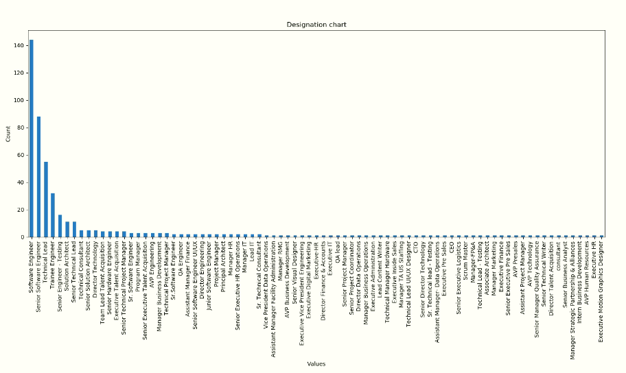

# scrape-employees-data-from-greythr
This repository serves as an illustration of how to retrieve and scrape data from Greythr using Selenium.

## Features
- Automate login on Greythr using employee username and password.
- Scrape all employees data and store it in xsls file.
- Construct a bar graph that illustrates the employee count categorized by their respective designations.

- Generate a Pie chart representing the distribution of employees based on their birth months.


## Dependencies
1. **Python**: Make sure Python is installed on your system. You can download the latest version of Python from the official Python website (https://www.python.org) and follow the installation instructions for your operating system.

2. **pip**: Check if pip is installed by running the following command in your command-line interface or terminal:
    ```sh
    pip --version
    ```

    If pip is not installed, you can install it by following the instructions provided on the official Python website.

3. **Chrome Browser**: Ensure that you have a Chrome web browser installed on your system. [The provided code has been tested on Chrome version 114.0.5735.198 (Official Build) (64-bit)]

4. **ChromeDriver**: Make sure the ChromeDriver version matches the Chrome browser version installed on your system. You can download ChromeDriver from the official ChromeDriver website (https://sites.google.com/a/chromium.org/chromedriver/downloads) and follow the installation instructions. [The driver version has also been included in the repository I provided]

5. **Used libraries**: Once you have fulfilled the above prerequisites, you can **Install the necessary libraries** using pip. Here is the command to install the required libraries:
    ```sh
    pip install -r requirements.txt
    ```
    
## Usage
1. Modify the configuration file (config.ini) by replacing **<YOUR_COMPANY_NAME>** with your company name, **<YOUR_USERNAME>** with your username, and **<YOUR_PASSWORD>** with your Greythr password.
2. To run the script, use the following command:
    ```sh
    python3 scrap.py
    ```
## License
**Free Software, Hell Yeah!**

## Authors
- [Rahul Gupta](https://github.com/rahulelex)
